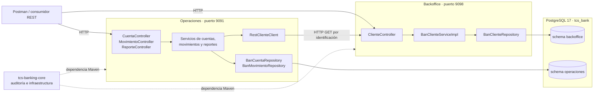
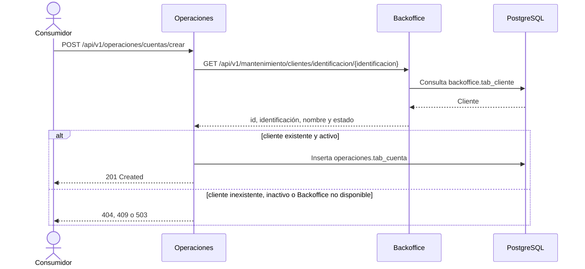
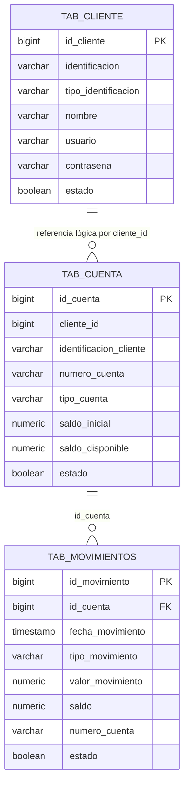

# TCS Banking — prueba técnica Backend Java

Solución backend para administrar clientes, cuentas bancarias, depósitos, retiros y estados de cuenta. El repositorio está compuesto por una librería compartida y dos aplicaciones Spring Boot que se comunican de forma síncrona mediante HTTP y persisten en una instancia PostgreSQL organizada en dos esquemas.

## Contenido

- [Arquitectura de la solución](#arquitectura-de-la-solución)
- [Módulos](#módulos)
- [Tecnologías utilizadas](#tecnologías-utilizadas)
- [Modelo de datos](#modelo-de-datos)
- [Reglas de negocio relevantes](#reglas-de-negocio-relevantes)
- [Documentación Swagger](#documentación-swagger)
- [API REST](#api-rest)
- [Configuración](#configuración)
- [Ejecución local](#ejecución-local)
- [Ejecución con Docker Compose](#ejecución-con-docker-compose)
- [Pruebas automatizadas](#pruebas-automatizadas)
- [Colección Postman](#colección-postman)
- [Script de base de datos](#script-de-base-de-datos)

## Arquitectura de la solución

La solución implementa una separación por capacidades de negocio:

- **Backoffice** administra personas/clientes.
- **Operaciones** administra cuentas, movimientos y reportes.
- **Core** proporciona clases reutilizables de persistencia, auditoría, excepciones e infraestructura.

Cada aplicación expone su propia API REST y mantiene capas concretas de controller, DTO, servicio, repositorio y entidad JPA. No se presenta como Clean Architecture, arquitectura hexagonal ni DDD porque la organización real corresponde a una arquitectura por capas.

Operaciones consulta Backoffice con `RestClient` al crear una cuenta y al generar un estado de cuenta. La integración es síncrona y utiliza el endpoint interno de consulta por identificación. No existen API Gateway ni mecanismos de descubrimiento de servicios en el repositorio.



### Flujo de creación de una cuenta



## Módulos

### `tcs-banking-core`

Artefacto Maven `jar` (`com.tcs.banking:tcs-banking-core:1.0.0`) consumido por Backoffice y Operaciones. No es una aplicación ejecutable.

Sus elementos principales son:

- `BaseEntidadAuditoria`: `@MappedSuperclass` con fecha de registro, fecha de actualización, observación e IP.
- `EntidadBase`, `EntidadAuditable` y `EntidadPersistible`: abstracciones reutilizables de persistencia.
- `GenericException`: excepción compartida.
- `ServerIpAddressResolver`: resolución de IP utilizada al registrar auditoría.

### `tcs-banking-backoffice`

Aplicación Spring Boot responsable del ciclo de vida de clientes:

- registra, lista, actualiza y elimina clientes;
- valida identificaciones `CED` y `RUC` por longitud y formato numérico;
- expone un contrato reducido para integraciones entre servicios, sin contraseña ni auditoría;
- persiste `BanCliente` en `backoffice.tab_cliente`;
- escucha en el puerto `9098`.

`BanPersona` es una superclase JPA y `BanCliente` es la entidad concreta. La aplicación usa `BanClienteRepository`, `BanClienteServiceImpl`, DTOs de entrada/salida y `ClienteResponseMapper`.

### `tcs-banking-operaciones`

Aplicación Spring Boot responsable de:

- crear, listar, actualizar y eliminar cuentas;
- registrar depósitos y retiros;
- listar, consultar y eliminar movimientos;
- generar estados de cuenta por cliente y rango de fechas;
- consultar Backoffice antes de crear cuentas y generar reportes;
- persistir `BanCuenta` y `BanMovimientos` en el esquema `operaciones`;
- escuchar en el puerto `9091`.

La creación de cuentas conserva el identificador y el `id` retornado por Backoffice. Esta referencia entre servicios se almacena como datos (`cliente_id` e `identificacion_cliente`), sin una clave foránea entre los esquemas. La relación JPA/FK existente es `BanMovimientos` `ManyToOne` hacia `BanCuenta`.

## Tecnologías utilizadas

| Tecnología | Versión | Uso comprobado |
|---|---|---|
| Java | 21 | Lenguaje y runtime de los tres módulos |
| Spring Boot | 4.1.0 | Framework base de Backoffice y Operaciones |
| Spring Web | Gestionada por Spring Boot | Controllers REST y cliente HTTP `RestClient` |
| Spring Data JPA | Gestionada por Spring Boot | Repositorios y acceso a datos |
| Hibernate ORM | Gestionada por Spring Boot | Implementación JPA y mapeo objeto-relacional |
| Jakarta Persistence API | 3.1.0 en Core | Anotaciones y contratos de persistencia compartidos |
| Jakarta Validation | Gestionada por Spring Boot | Validación de requests con `@Valid`, `@NotNull` y `@NotBlank` |
| PostgreSQL | 17 (`postgres:17-alpine`) | Base de datos relacional |
| PostgreSQL JDBC Driver | Gestionada por Spring Boot | Conectividad JDBC en tiempo de ejecución |
| Lombok | 1.18.32 en Core; gestionada por Spring Boot en las APIs | Generación de getters y setters |
| Maven | 3.9.9 en Maven Wrapper; imagen de build 3.9 | Compilación, pruebas y empaquetado |
| JUnit Jupiter | 5.10.2 en Core; gestionada por Spring Boot en las APIs | Pruebas automatizadas |
| Mockito / MockMvc | Gestionadas por `spring-boot-starter-test` | Pruebas unitarias y de controllers |
| Springdoc OpenAPI | 3.0.0 | Especificación OpenAPI y documentación interactiva Swagger UI |
| Docker / Docker Compose | Compose `2.4` | Construcción y orquestación local |

No se encontraron dependencias ni configuración de Kafka, Redis, Spring Boot Actuator, JWT, API Gateway, circuit breaker, Kubernetes o Testcontainers.

## Modelo de datos

La base configurada es `tcs_bank`. Hibernate está configurado con `spring.jpa.hibernate.ddl-auto=update`; Docker crea previamente los esquemas mediante `docker/postgres/init/01-create-schemas.sql` cuando inicializa un volumen nuevo.

| Esquema | Tabla | Entidad | Responsabilidad |
|---|---|---|---|
| `backoffice` | `tab_cliente` | `BanCliente` | Datos personales, identificación, usuario, contraseña, estado y auditoría |
| `operaciones` | `tab_cuenta` | `BanCuenta` | Número y tipo de cuenta, saldos, estado y referencia lógica al cliente |
| `operaciones` | `tab_movimientos` | `BanMovimientos` | Depósitos/retiros, valor, saldo resultante, fecha y cuenta |

Las entidades usan las secuencias `sec_cliente`, `sec_cuenta` y `sec_movimiento` del esquema `public`.



> La línea punteada representa una asociación lógica entre servicios; el dump SQL no define una FK desde cuenta hacia cliente. La FK física existente une movimiento con cuenta.

## Reglas de negocio relevantes

### Nomenclaturas

| Tipo | Código | Significado |
|---|---|---|
| Identificación | `CED` | Cédula de 10 dígitos |
| Identificación | `RUC` | Registro Único de Contribuyentes de 13 dígitos |
| Cuenta | `AHO` | Cuenta de Ahorro |
| Cuenta | `CTE` | Cuenta Corriente |
| Movimiento | `DEP` | Depósito |
| Movimiento | `RET` | Retiro |

Los códigos se serializan como texto en JSON y se almacenan con `EnumType.STRING`.

### Cuentas y movimientos

- Una cuenta solo se crea si Backoffice devuelve un cliente existente y activo.
- El saldo inicial debe ser mayor o igual a cero.
- El número de cuenta se genera con 10 dígitos mediante `SecureRandom`.
- El procesamiento de un movimiento es `@Transactional`.
- La cuenta se consulta con `PESSIMISTIC_WRITE` para serializar actualizaciones concurrentes de saldo.
- Un retiro que dejaría saldo negativo es rechazado con HTTP `400` y el mensaje `Saldo no disponible`.
- El movimiento y el saldo disponible se guardan dentro de la misma transacción.
- El reporte interpreta el rango de fechas como inclusivo; internamente consulta desde el inicio del primer día hasta el inicio del día posterior a la fecha final.

## Documentación Swagger

Cada microservicio publica automáticamente la especificación OpenAPI y una interfaz Swagger UI. Con PostgreSQL y las aplicaciones en ejecución, la documentación está disponible en:

| Servicio | Swagger UI | OpenAPI JSON |
|---|---|---|
| Backoffice | [http://localhost:9098/swagger-ui.html](http://localhost:9098/swagger-ui.html) | [http://localhost:9098/v3/api-docs](http://localhost:9098/v3/api-docs) |
| Operaciones | [http://localhost:9091/swagger-ui.html](http://localhost:9091/swagger-ui.html) | [http://localhost:9091/v3/api-docs](http://localhost:9091/v3/api-docs) |

Swagger UI permite consultar los contratos y ejecutar solicitudes sobre los endpoints REST desde el navegador.

## API REST

### Backoffice — clientes

Base URL local: `http://localhost:9098`

#### 1. **Registrar un cliente**

- **URL**: `/api/v1/mantenimiento/clientes/crear`
- **Método**: `POST`
- **Descripción**: Registra un cliente. La identificación debe ser única y corresponder con la longitud de `CED` o `RUC`. El servicio genera el usuario y una contraseña numérica.
- **Cuerpo de la solicitud**:

    ```json
    {
      "tipoIdentificacion": "CED",
      "identificacion": "0945678903",
      "nombre": "PEDRO VELA",
      "genero": "M",
      "edad": "35",
      "direccion": "AV. ORELLANA 1452",
      "telefono": "0954321789"
    }
    ```

- **Respuesta exitosa (`201 Created`)**:

    ```json
    {
      "fechaEjecucion": "2026-08-09T23:05:00.000+00:00",
      "mensaje": "Transacción realizada con éxito",
      "cliente": {
        "id": 1,
        "nombre": "PEDRO VELA",
        "genero": "M",
        "edad": "35",
        "identificacion": "0945678903",
        "tipoIdentificacion": "CED",
        "direccion": "AV. ORELLANA 1452",
        "telefono": "0954321789",
        "estado": true
      }
    }
    ```

- **Otros códigos**: `400 Bad Request`, `409 Conflict`, `500 Internal Server Error`.

#### 2. **Listar clientes**

- **URL**: `/api/v1/mantenimiento/clientes/listar`
- **Método**: `GET`
- **Descripción**: Retorna todos los clientes mediante DTOs que no exponen contraseña ni campos de auditoría.
- **Cuerpo de la solicitud**: No aplica.
- **Respuesta exitosa (`200 OK`)**:

    ```json
    {
      "fechaEjecucion": "2026-08-09T23:06:00.000+00:00",
      "mensaje": "Clientes consultados correctamente.",
      "total": 1,
      "clientes": [
        {
          "id": 1,
          "nombre": "PEDRO VELA",
          "genero": "M",
          "edad": "35",
          "identificacion": "0945678903",
          "tipoIdentificacion": "CED",
          "direccion": "AV. ORELLANA 1452",
          "telefono": "0954321789",
          "estado": true
        }
      ]
    }
    ```

- **Sin registros**: `204 No Content`.

#### 3. **Consultar un cliente por identificación**

- **URL**: `/api/v1/mantenimiento/clientes/consultarPersonaPorIdentificacion/{identificacion}`
- **Método**: `GET`
- **Descripción**: Consulta un cliente por su identificación y retorna el contrato público seguro.
- **Parámetro de ruta**: `identificacion`, por ejemplo `0945678903`.
- **Cuerpo de la solicitud**: No aplica.
- **Respuesta exitosa (`200 OK`)**:

    ```json
    {
      "fechaEjecucion": "2026-08-09T23:07:00.000+00:00",
      "mensaje": "Cliente consultado correctamente.",
      "cliente": {
        "id": 1,
        "nombre": "PEDRO VELA",
        "genero": "M",
        "edad": "35",
        "identificacion": "0945678903",
        "tipoIdentificacion": "CED",
        "direccion": "AV. ORELLANA 1452",
        "telefono": "0954321789",
        "estado": true
      }
    }
    ```

- **Cliente inexistente**: `404 Not Found` sin cuerpo.

#### 4. **Consultar el contrato interno de un cliente**

- **URL**: `/api/v1/mantenimiento/clientes/identificacion/{identificacion}`
- **Método**: `GET`
- **Descripción**: Endpoint consumido por Operaciones para validar la existencia y el estado del cliente sin exponer contraseña ni auditoría.
- **Parámetro de ruta**: `identificacion`, por ejemplo `0945678903`.
- **Cuerpo de la solicitud**: No aplica.
- **Respuesta exitosa (`200 OK`)**:

    ```json
    {
      "id": 1,
      "identificacion": "0945678903",
      "tipoIdentificacion": "CED",
      "nombre": "PEDRO VELA",
      "estado": true
    }
    ```

- **Cliente inexistente**: `404 Not Found` sin cuerpo.

#### 5. **Actualizar información de un cliente**

- **URL**: `/api/v1/mantenimiento/clientes/actualizar/{identificacion}`
- **Método**: `PUT`
- **Descripción**: Actualiza los datos del cliente identificado en la URL. El tipo de identificación debe coincidir con la longitud de la identificación recibida.
- **Parámetro de ruta**: `identificacion`, por ejemplo `0945678903`.
- **Cuerpo de la solicitud**:

    ```json
    {
      "tipoIdentificacion": "CED",
      "nombre": "PEDRO VELA ACTUALIZADO",
      "genero": "M",
      "edad": "36",
      "direccion": "AV. ORELLANA 1452 Y CALLE 20",
      "telefono": "0999999999",
      "contrasena": "123456"
    }
    ```

- **Respuesta exitosa (`200 OK`)**:

    ```json
    {
      "fechaEjecucion": "2026-08-09T23:08:00.000+00:00",
      "mensaje": "Cliente actualizado exitosamente",
      "cliente": {
        "id": 1,
        "nombre": "PEDRO VELA ACTUALIZADO",
        "genero": "M",
        "edad": "36",
        "identificacion": "0945678903",
        "tipoIdentificacion": "CED",
        "direccion": "AV. ORELLANA 1452 Y CALLE 20",
        "telefono": "0999999999",
        "estado": true
      }
    }
    ```

- **Otros códigos**: `400 Bad Request`, `404 Not Found`, `500 Internal Server Error`.

#### 6. **Eliminar un cliente**

- **URL**: `/api/v1/mantenimiento/clientes/eliminar/{identificacion}`
- **Método**: `DELETE`
- **Descripción**: Elimina el cliente localizado por identificación.
- **Parámetro de ruta**: `identificacion`, por ejemplo `0945678903`.
- **Cuerpo de la solicitud**: No aplica.
- **Respuesta exitosa (`200 OK`)**:

    ```json
    {
      "fechaEjecucion": "2026-08-09T23:09:00.000+00:00",
      "mensaje": "Cliente eliminado correctamente."
    }
    ```

- **Cliente inexistente**: `404 Not Found`.

### Operaciones — cuentas

Base URL local: `http://localhost:9091`

#### 1. **Crear una cuenta**

- **URL**: `/api/v1/operaciones/cuentas/crear`
- **Método**: `POST`
- **Descripción**: Crea una cuenta para un cliente existente y activo, validado de forma síncrona en Backoffice. El número de cuenta se genera con 10 dígitos.
- **Cuerpo de la solicitud**:

    ```json
    {
      "tipoCuenta": "CTE",
      "saldoInicial": 100.00,
      "identificacionCliente": "0945678903"
    }
    ```

- **Respuesta exitosa (`201 Created`)**:

    ```json
    {
      "fechaEjecucion": "2026-08-09T23:10:00.000+00:00",
      "mensaje": "Cuenta creada correctamente.",
      "cuenta": {
        "id": 1,
        "numeroCuenta": "9310667904",
        "tipoCuenta": "CTE",
        "saldoInicial": 100.00,
        "saldoDisponible": 100.00,
        "estado": true,
        "clienteId": 1,
        "identificacionCliente": "0945678903"
      }
    }
    ```

- **Otros códigos**: `400 Bad Request`, `404 Not Found`, `409 Conflict`, `503 Service Unavailable`.

#### 2. **Listar cuentas**

- **URL**: `/api/v1/operaciones/cuentas/listar`
- **Método**: `GET`
- **Descripción**: Retorna todas las cuentas registradas.
- **Cuerpo de la solicitud**: No aplica.
- **Respuesta exitosa (`200 OK`)**:

    ```json
    {
      "fechaEjecucion": "2026-08-09T23:11:00.000+00:00",
      "mensaje": "Cuentas consultadas correctamente.",
      "total": 1,
      "cuentas": [
        {
          "id": 1,
          "numeroCuenta": "9310667904",
          "tipoCuenta": "CTE",
          "saldoInicial": 100.00,
          "saldoDisponible": 100.00,
          "estado": true,
          "clienteId": 1,
          "identificacionCliente": "0945678903"
        }
      ]
    }
    ```

- **Sin registros**: `204 No Content`.

#### 3. **Actualizar una cuenta**

- **URL**: `/api/v1/operaciones/cuentas/actualizar/{numeroCuenta}`
- **Método**: `PUT`
- **Descripción**: Actualiza el tipo, saldo inicial y estado de una cuenta existente.
- **Parámetro de ruta**: `numeroCuenta`, por ejemplo `9310667904`.
- **Cuerpo de la solicitud**:

    ```json
    {
      "tipoCuenta": "AHO",
      "saldoInicial": 200.00,
      "estado": true,
      "identificacionCliente": "0945678903"
    }
    ```

- **Respuesta exitosa (`200 OK`)**:

    ```json
    {
      "fechaEjecucion": "2026-08-09T23:12:00.000+00:00",
      "mensaje": "Cuenta actualizada correctamente.",
      "cuenta": {
        "id": 1,
        "numeroCuenta": "9310667904",
        "tipoCuenta": "AHO",
        "saldoInicial": 200.00,
        "saldoDisponible": 100.00,
        "estado": true,
        "clienteId": 1,
        "identificacionCliente": "0945678903"
      }
    }
    ```

- **Otros códigos**: `400 Bad Request`, `404 Not Found`.

#### 4. **Eliminar una cuenta**

- **URL**: `/api/v1/operaciones/cuentas/eliminar/{numeroCuenta}`
- **Método**: `DELETE`
- **Descripción**: Elimina una cuenta localizada por su número.
- **Parámetro de ruta**: `numeroCuenta`, por ejemplo `9310667904`.
- **Cuerpo de la solicitud**: No aplica.
- **Respuesta exitosa (`200 OK`)**:

    ```json
    {
      "fechaEjecucion": "2026-08-09T23:13:00.000+00:00",
      "mensaje": "Cuenta eliminada correctamente."
    }
    ```

- **Cuenta inexistente**: `404 Not Found`.

### Operaciones — movimientos

#### 1. **Registrar un movimiento**

- **URL**: `/api/v1/operaciones/movimientos/transaccion`
- **Método**: `POST`
- **Descripción**: Registra un depósito (`DEP`) o retiro (`RET`) y actualiza el saldo disponible dentro de la misma transacción.
- **Cuerpo de la solicitud**:

    ```json
    {
      "tipoMovimiento": "DEP",
      "valor": 150.85,
      "numeroCuenta": "9310667904"
    }
    ```

- **Respuesta exitosa (`201 Created`)**:

    ```json
    {
      "fechaEjecucion": "2026-08-09T23:14:00.000+00:00",
      "mensaje": "Depósito creado correctamente.",
      "movimiento": {
        "id": 1,
        "fechaMovimiento": "2026-08-09T23:14:00.000+00:00",
        "numeroCuenta": "9310667904",
        "tipoCuenta": "CTE",
        "tipoMovimiento": "DEP",
        "valor": 150.85,
        "saldoAnterior": 100.00,
        "saldoDisponible": 250.85
      }
    }
    ```

- **Otros códigos**: `400 Bad Request` para solicitudes inválidas o saldo insuficiente; `404 Not Found` si la cuenta no existe.

#### 2. **Listar movimientos**

- **URL**: `/api/v1/operaciones/movimientos/listar`
- **Método**: `GET`
- **Descripción**: Retorna todos los movimientos registrados mediante DTOs.
- **Cuerpo de la solicitud**: No aplica.
- **Respuesta exitosa (`200 OK`)**:

    ```json
    {
      "fechaEjecucion": "2026-08-09T23:15:00.000+00:00",
      "mensaje": "Movimientos consultados correctamente.",
      "total": 1,
      "movimientos": [
        {
          "id": 1,
          "fechaMovimiento": "2026-08-09T23:14:00.000+00:00",
          "numeroCuenta": "9310667904",
          "tipoCuenta": "CTE",
          "tipoMovimiento": "DEP",
          "valor": 150.85,
          "saldoAnterior": 100.00,
          "saldoDisponible": 250.85
        }
      ]
    }
    ```

- **Sin registros**: `204 No Content`.

#### 3. **Consultar un movimiento**

- **URL**: `/api/v1/operaciones/movimientos/consultar/{idMovimiento}`
- **Método**: `GET`
- **Descripción**: Consulta un movimiento por su identificador.
- **Parámetro de ruta**: `idMovimiento`, por ejemplo `1`.
- **Cuerpo de la solicitud**: No aplica.
- **Respuesta exitosa (`200 OK`)**:

    ```json
    {
      "fechaEjecucion": "2026-08-09T23:16:00.000+00:00",
      "mensaje": "Movimiento consultado correctamente.",
      "movimiento": {
        "id": 1,
        "fechaMovimiento": "2026-08-09T23:14:00.000+00:00",
        "numeroCuenta": "9310667904",
        "tipoCuenta": "CTE",
        "tipoMovimiento": "DEP",
        "valor": 150.85,
        "saldoAnterior": 100.00,
        "saldoDisponible": 250.85
      }
    }
    ```

- **Movimiento inexistente**: `404 Not Found`.

#### 4. **Eliminar un movimiento**

- **URL**: `/api/v1/operaciones/movimientos/eliminar/{idMovimiento}`
- **Método**: `DELETE`
- **Descripción**: Elimina únicamente el movimiento identificado por `idMovimiento`.
- **Parámetro de ruta**: `idMovimiento`, por ejemplo `1`.
- **Cuerpo de la solicitud**: No aplica.
- **Respuesta exitosa (`200 OK`)**:

    ```json
    {
      "fechaEjecucion": "2026-08-09T23:17:00.000+00:00",
      "mensaje": "Movimiento eliminado correctamente."
    }
    ```

- **Movimiento inexistente**: `404 Not Found`.

### Operaciones — estado de cuenta

#### 1. **Generar estado de cuenta**

- **URL**: `/api/v1/operaciones/reportes/estado-cuenta`
- **Método**: `POST`
- **Descripción**: Retorna el cliente, todas sus cuentas y los movimientos comprendidos en un rango inclusivo. Las fechas del request deben usar `dd-MM-yyyy`.
- **Cuerpo de la solicitud**:

    ```json
    {
      "identificacionCliente": "0945678903",
      "fechaInicio": "01-08-2026",
      "fechaFin": "30-08-2026"
    }
    ```

- **Respuesta exitosa (`200 OK`)**:

    ```json
    {
      "fechaEjecucion": "2026-08-09T23:18:00.000+00:00",
      "mensaje": "Reporte generado correctamente.",
      "reporte": {
        "fechaDesde": "2026-08-01",
        "fechaHasta": "2026-08-30",
        "cliente": {
          "id": 1,
          "identificacion": "0945678903",
          "nombre": "PEDRO VELA"
        },
        "cuentas": [
          {
            "numeroCuenta": "9310667904",
            "tipoCuenta": "CTE",
            "saldoInicial": 100.00,
            "saldoDisponible": 250.85,
            "estado": true,
            "movimientos": [
              {
                "id": 1,
                "fechaMovimiento": "2026-08-09T23:14:00.000+00:00",
                "tipoMovimiento": "DEP",
                "valor": 150.85,
                "saldoDisponible": 250.85
              }
            ]
          }
        ]
      }
    }
    ```

- **Otros códigos**: `400 Bad Request`, `404 Not Found`, `503 Service Unavailable`.

Los errores controlados de Operaciones utilizan este contrato:

```json
{
  "mensaje": "Descripción del error",
  "fecha": "2026-08-09T23:18:00Z"
}
```

## Configuración

### Variables de las aplicaciones

| Variable | Aplicación | Valor local predeterminado | Uso |
|---|---|---|---|
| `DB_URL` | Ambas | `jdbc:postgresql://localhost:5432/tcs_bank` | URL JDBC |
| `DB_USERNAME` | Ambas | `admin` | Usuario PostgreSQL |
| `DB_PASSWORD` | Ambas | `123456789` | Contraseña PostgreSQL local |
| `BACKOFFICE_BASE_URL` | Operaciones | `http://localhost:9098` | URL base del cliente HTTP |

### Variables de Docker Compose

| Variable | Valor predeterminado |
|---|---|
| `POSTGRES_DB` | `tcs_bank` |
| `POSTGRES_USER` | `admin` |
| `POSTGRES_PASSWORD` | `change_me` |
| `POSTGRES_PORT` | `5432` |
| `BACKOFFICE_PORT` | `9098` |
| `OPERACIONES_PORT` | `9091` |

Copiar la plantilla antes de usar Compose y reemplazar la contraseña:

```bash
cp .env.example .env
```

`.env` está excluido de Git. No se deben versionar credenciales reales.

## Ejecución local

### Requisitos

- JDK 21.
- Maven 3.9.x. Los módulos ejecutables incluyen Maven Wrapper 3.9.9.
- PostgreSQL accesible mediante la configuración indicada anteriormente.
- Esquemas `backoffice` y `operaciones` creados en `tcs_bank`.

Desde la raíz, instalar primero la librería compartida:

```bash
mvn -B -ntp -f tcs-banking-core/pom.xml clean install
```

Iniciar Backoffice:

```bash
mvn -f tcs-banking-backoffice/pom.xml spring-boot:run
```

En otra terminal, iniciar Operaciones:

```bash
mvn -f tcs-banking-operaciones/pom.xml spring-boot:run
```

La base puede prepararse restaurando [`database/BaseDatos.sql`](database/BaseDatos.sql) o creando los esquemas y permitiendo que Hibernate actualice las tablas. El script mínimo de esquemas está en [`docker/postgres/init/01-create-schemas.sql`](docker/postgres/init/01-create-schemas.sql).

## Ejecución con Docker Compose

`compose.yaml` orquesta tres servicios sobre la red bridge `banking`:

| Servicio | Imagen/build | Puerto publicado | Dependencias |
|---|---|---:|---|
| `postgres` | `postgres:17-alpine` | `5432` | Healthcheck con `pg_isready` |
| `backoffice` | Dockerfile multi-stage | `9098` | PostgreSQL saludable |
| `operaciones` | Dockerfile multi-stage | `9091` | PostgreSQL saludable y Backoffice iniciado |

Los Dockerfiles compilan con Maven 3.9 y Java 21, generan un JAR ejecutable y lo ejecutan sobre Eclipse Temurin 21 JRE con un usuario `banking` sin privilegios.

Construir e iniciar el ecosistema:

```bash
cp .env.example .env
docker-compose up --build -d
```

Comprobar estado y logs:

```bash
docker-compose ps
docker-compose logs --tail=100 backoffice operaciones
docker-compose logs -f backoffice operaciones
```

Dentro de la red Docker, las aplicaciones se conectan a `postgres:5432` y Operaciones consume Backoffice en `http://backoffice:9098`. Los puertos `localhost` se utilizan desde el host.

PostgreSQL persiste sus datos en el volumen nombrado `postgres_data`, montado en `/var/lib/postgresql/data`:

```bash
docker-compose down
```

El comando anterior conserva el volumen. Para eliminar deliberadamente contenedores **y datos**:

```bash
docker-compose down -v
```

> Si el puerto `5432` ya está ocupado, definir otro puerto del host en `.env`, por ejemplo `POSTGRES_PORT=5433`. La conexión interna entre contenedores continúa usando `postgres:5432`.

## Pruebas automatizadas

La suite incluye pruebas unitarias, de servicios, de controllers con MockMvc y dos pruebas de integración JPA contra PostgreSQL real. No utiliza Testcontainers.

Para ejecutar la secuencia completa, PostgreSQL debe estar disponible en la URL configurada porque las pruebas `TipoCuentaJpaPostgreSqlIntegrationTest` y `TipoMovimientoJpaPostgreSqlIntegrationTest` cargan el contexto de Spring y acceden a la base:

```bash
mvn -B -ntp -f tcs-banking-core/pom.xml clean install
mvn -B -ntp -f tcs-banking-backoffice/pom.xml test
mvn -B -ntp -f tcs-banking-operaciones/pom.xml test
```

Resultado verificado en Java 21:

| Módulo | Resultado |
|---|---|
| Core | Compilación e instalación exitosas; no contiene tests en `src/test` |
| Backoffice | 10 pruebas, 0 fallos, 0 errores |
| Operaciones | 37 pruebas, 0 fallos, 0 errores |

## Colección Postman

La colección [`postman/tcs-banking-test.postman_collection.json`](postman/tcs-banking-test.postman_collection.json) contiene solicitudes para clientes, cuentas, movimientos y estado de cuenta con URLs locales en los puertos `9098` y `9091`.

Para usarla:

1. Levantar Backoffice, Operaciones y PostgreSQL.
2. En Postman, seleccionar **Import**.
3. Importar `postman/tcs-banking-test.postman_collection.json`.
4. Ejecutar primero la creación del cliente, luego la cuenta y finalmente los movimientos o el reporte; algunos requests posteriores utilizan identificadores o números de cuenta de ejemplo que deben ajustarse a los datos creados.

## Script de base de datos

[`database/BaseDatos.sql`](database/BaseDatos.sql) es un dump PostgreSQL en formato plain con estructura y datos de `tcs_bank`: esquemas, tablas, secuencias, claves primarias, la FK movimiento-cuenta y registros de prueba.

Restauración sobre una base existente y vacía:

```bash
psql -h localhost -p 5432 -U admin -d tcs_bank -f database/BaseDatos.sql
```

El dump fue generado con opciones de limpieza e `IF EXISTS`, sin propietarios ni privilegios específicos, para reducir dependencias con el entorno de origen.

## Estructura principal

```text
tcs-banking-test/
├── compose.yaml
├── database/
│   └── BaseDatos.sql
├── docker/postgres/init/
│   └── 01-create-schemas.sql
├── postman/
│   └── tcs-banking-test.postman_collection.json
├── tcs-banking-core/
├── tcs-banking-backoffice/
│   └── Dockerfile
└── tcs-banking-operaciones/
    └── Dockerfile
```
